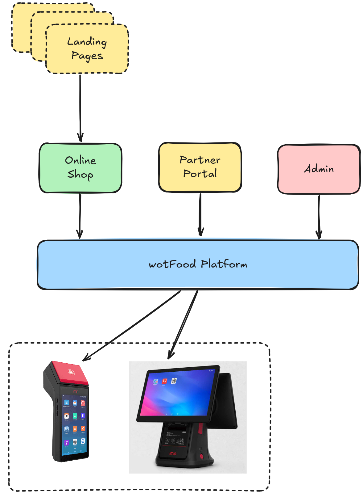
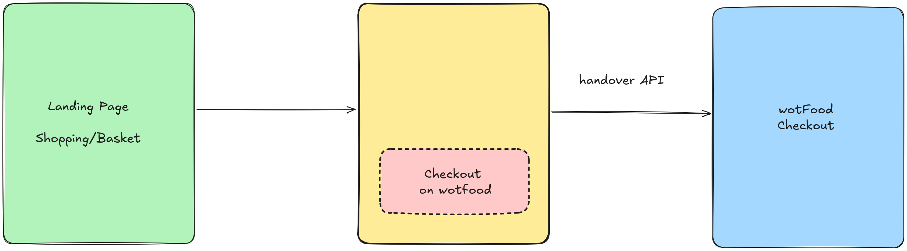

# wotFood Public API

wotFood is an online fast food ordering platform like `JustEat` / `uberEats` and others. The purpose of this documentation is aimed at external 3rd Parties that wish to integrate with the wotFood platform using the "Public APIs".

## General Platform overview

wotFood is a custom multi-tenant eCommerce platform with deep hardware integration that runs at the partner's shops. We have a number of "landing pages" that are static and these pages link to each specfic online shop. When customers place an order, this is routed in realtime to the hardware at the shop, orders are then authorised or declined and the results are feed back to the customer. Once an order has been authorised the order is printed at the shop and the customer is given a confirmation email.

## Customer Journey

The customer experience for each shop can be deeply unique that can reflect very closely to each shops own branding, and the Public APIs allows pulling each shops metadata. Using the shops metadata the usual basket/cart interaction can be implemented.

Once all the products/items are added to the shopping basket/cart, a "call to action" button with something like "Checkout on wotFood" can then be used, and then the basket/cart data can be securely transferred to the wotFood platform using the `handover` API. Once the basket data has been transferred the customer can be redirected to the wotFood checkout page where they can place their order with the shop and make payment.

### Public API

- Headers: `Content-Type: application/json`
- HTTP Verb: `POST`
- Staging Base URL: `https://neo.wotfood.co.uk`

| URL                            | Mandatory Parameters     | Description                                 |
| ------------------------------ | ------------------------ | ------------------------------------------- |
| /api/public/shop-details       | Company Id               | Returns meta data about the shop            |
| /api/public/opening-times      | Company Id               | Returns the shops opening and closing times |
| /api/public/menu-data          | Company Id               | Returns the shops menu data                 |
| /api/public/item-extra-options | Compnay Id + Item Id     | Returns Items custom optional exta data     |
| /api/public/handover-basker    | company Id + Basket Data | Returns the session Id for this checkout    |
